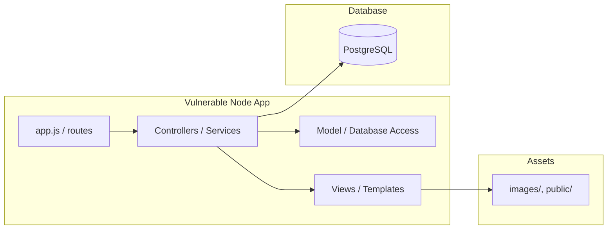
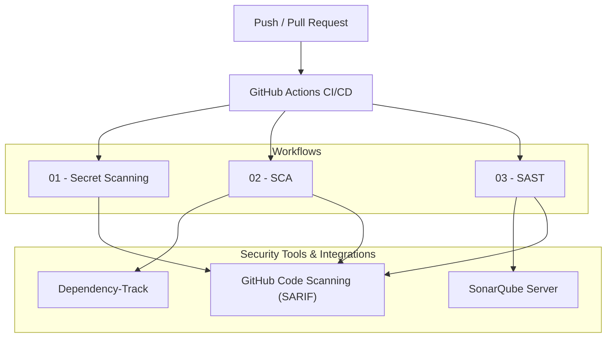
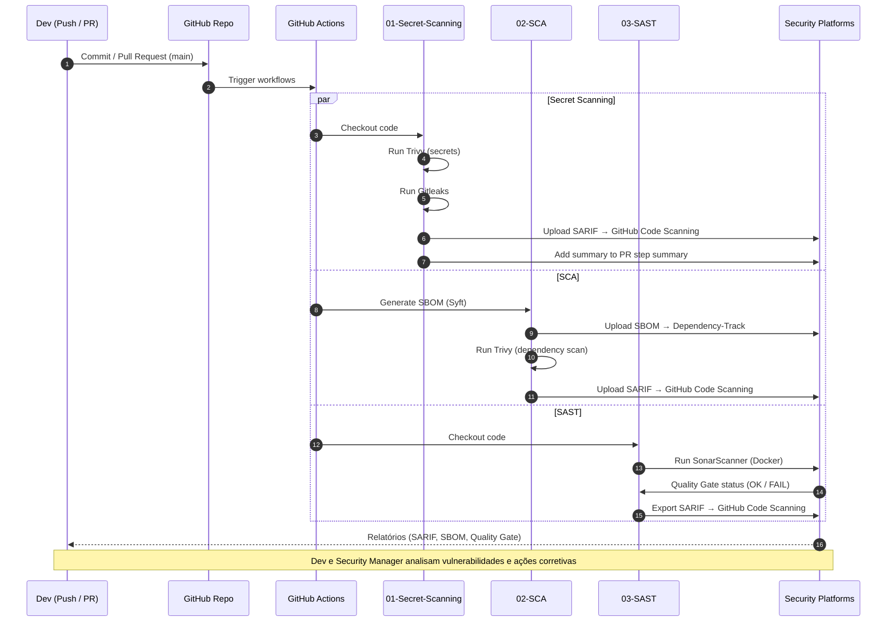
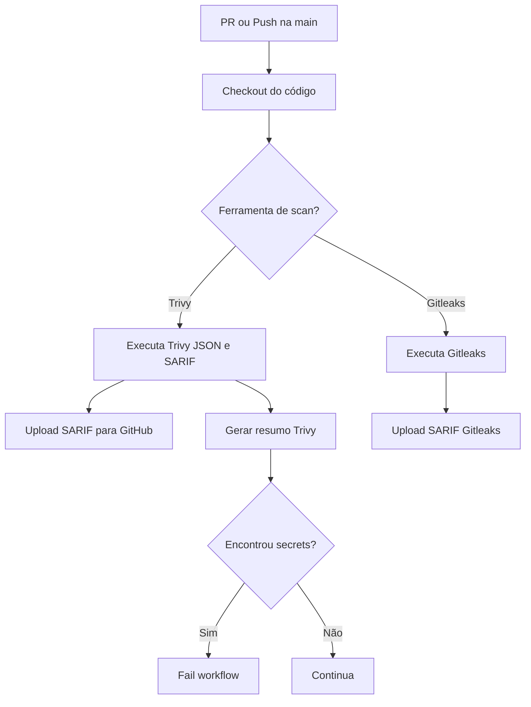
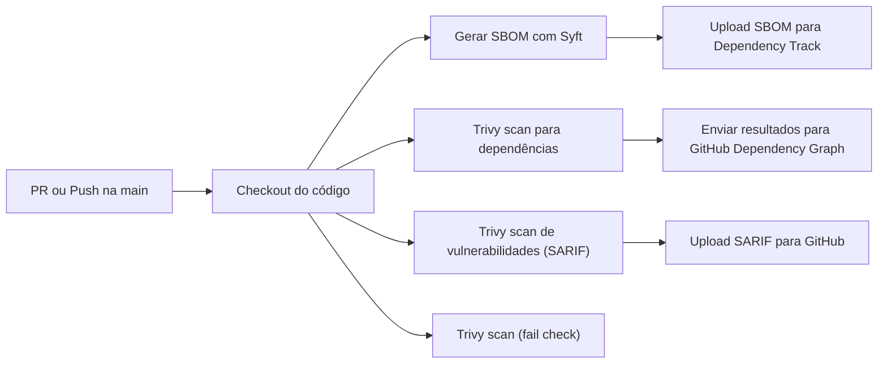
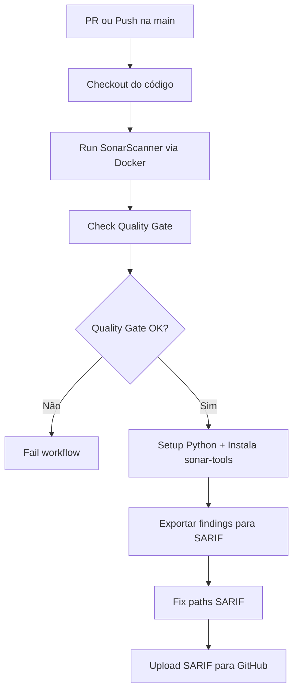
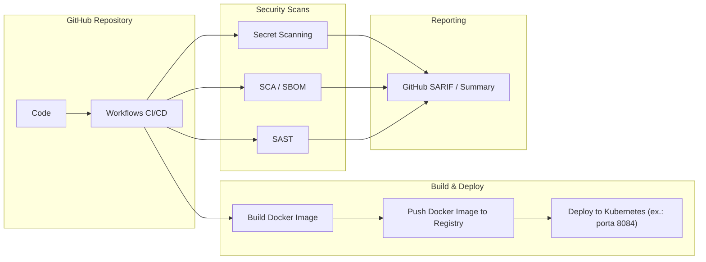

# 🧩 Projeto Final — DevSecOps com Vulnerable Node

Este repositório é uma cópia estendida do projeto [cr0hn/vulnerable-node](https://github.com/cr0hn/vulnerable-node) — uma aplicação **Node.js intencionalmente vulnerável** para fins educacionais.  
Aqui usamos essa aplicação para demonstrar pipelines DevSecOps no **GitHub Actions** (SAST, SCA, Secret Scanning, SBOM), mantendo o app executável via **docker-compose** conforme o projeto original.

> ⚠️ **Aviso:** o aplicativo contém vulnerabilidades reais intencionais. Não execute em produção nem exponha em rede pública.


## 📦 Entregáveis

Para facilitar a avaliação da evolução do projeto, disponibilizamos evidências detalhadas do desenvolvimento e das práticas aplicadas:

- **Documentos PDF**

  1. [Jornada Final DevSecOps na prática](reports/Jornada%20Final%20DevSecOps%20na%20Prática.pdf)  
  2. [Ferramentas utilizadas para scans de segurança - evidências](reports/Relatório%20de%20Ferramentas%20utilizadas.pdf)  

- **Imagens / prints**  
  - Pasta completa com dezenas de capturas de tela mostrando pipelines, scans e resultados: [`reports/screenshots`](reports/screenshots/)

> 💡 Observação: esta seção reúne os principais resultados práticos do projeto, permitindo uma visão rápida das evidências de desenvolvimento antes de explorar os detalhes técnicos, estrutura do repositório e workflows.

---

## 🧭 Como executar

### Pré-requisitos
- Docker
- Docker Compose

### Clonar o repositório
```bash
git clone https://github.com/doug-cpp-devsecops/proj-final.git
cd proj-final
```

### Construir e subir containers

No diretório raiz:

```bash
docker-compose build && docker-compose up -d
```

### Acessar a aplicação

Abra no navegador:

```bash
http://127.0.0.1:3000
```

### Credenciais exibidas na landing page

- `admin : admin`    
- `roberto : asdfpiuw981`

> **Obs.:** Não é necessário logar com as credenciais mostradas, pois existe uma vulnerabilidade relacionada e o navegador se recusa a entrar com erros de sessão.

### 1️⃣ Arquitetura da aplicação (`vulnerable-node`)




---


## 🧰 Estrutura do repositório

Abaixo a listagem dos arquivos e pastas relevantes no repositório.   Os itens criados propositalmente para gerar vulnerabilidades ou suportar os workflows estão comentados.

```text
.
├── allocations-dao.js           # lógica insegura para demonstração de falhas
├── app.js
├── attacks/
├── bin/
├── config.js
├── Dockerfile
├── docker-compose.yml
├── dummy.js                     # utilitário de teste / fake data
├── images/
├── kind-config.yaml             # configuração do Kind para testes locais
├── k8s/                         # manifests Kubernetes (ex.: deploy em porta 8084)
├── LICENSE
├── model/
├── my-tokens.env                # tokens falsos para testar secret scanning
├── package.json
├── package-lock.json
├── package.json.bak             # backup do package.json
├── public/
├── README.md
├── routes/
├── scanner/
│    └── sast/
├── scripts/                     # helpers para rodar local e CI
├── services/
│    └── postgresql/
├── test-secrets.env             # secrets de teste para scanners
├── views/
└── .github/workflows/           # workflows do GitHub Actions
    ├── 01-secret-scanning.yml   # detecção de segredos (Trivy + Gitleaks)
    ├── 02-sca.yml               # SBOM e Dependency Scan
    └── 03-sast.yml              # SAST com SonarQube
```

### Notas sobre os itens comentados

- `allocations-dao.js` e `dummy.js`: criam vulnerabilidades ou dados falsos para testes de scanners.
- `my-tokens.env` e `test-secrets.env`: tokens/secrets falsos para testes; nunca usar reais.
- `k8s/` e `kind-config.yaml`: manifests para demo de deploy em Kubernetes.
- `scripts/`: helpers para pipelines locais e testes.
- `package.json.bak`: backup local.
- `.github/workflows/`: contém todos os workflows de CI/CD e scans de segurança, detalhados abaixo:
    - `01-secret-scanning.yml`: detecta segredos no código usando Trivy e Gitleaks.
    - `02-sca.yml`: gera SBOM e roda scans de dependências (Dependency Track e Trivy).
    - `03-sast.yml`: executa análise SAST via SonarQube e exporta SARIF para GitHub.

## 🔐 Pipelines de segurança configurados (GitHub Actions)

Neste repositório foram adicionados **3 workflows** que rodam em `push` e `pull_request` para a branch `main`:

1. **01 - Secret Scanning** (`01-secret-scanning.yml`)
    - Matrix: `trivy` (scanners: secret) e `gitleaks`.
    - Produz: JSON, SARIF (upload para GitHub Code Scanning) e resumo no step summary.
    - Política: falha se Trivy encontrar segredos (exit code configurado) — Gitleaks também produz SARIF.
        
2. **02 - SCA** (`02-sca.yml`)
    - Gera **SBOM** com `syft` (via anchore/sbom-action).
    - Envia SBOM para **Dependency-Track** (upload).
    - Executa Trivy em modo SBOM/GitHub e produz SARIF/relatórios de dependência.
        
3. **03 - SAST** (`03-sast.yml`)
    - Roda **SonarScanner** dentro de um container Docker que aponta para um SonarQube (host configurado).
    - Checa **Quality Gate** via API do SonarQube; falha a job caso o gate não seja `OK`.
    - Exporta achados Sonar para SARIF e faz upload para GitHub Code Scanning.

>>**OBS.:** todos os workflows são disparados automaticamente quando há `push` ou `pull_request` para `main`. Eles são concorrentes (rodando em paralelo) e cada um faz upload de SARIFs/artefatos aos destinos configurados.

## 🧭 Diagrama 1 — Visão Geral dos Workflows



**Explicação curta:**

- A cada push/PR em `main`, os três workflows disparam.
- SARIFs do Trivy/Sonar/Gitleaks são enviados para o Code Scanning do GitHub, e o SBOM é enviado para o Dependency-Track.

## ⚙️ Diagrama 2 — Sequência do Pipeline CI/CD



> **Obs:** os passos de "fail" (ex.: falhar o job quando o Quality Gate não é OK, ou quando Trivy retorna exit code = 1) estão configurados nos workflows — assim o PR pode ser bloqueado até correção.

### Workflow 01 – Secret Scanning




### Workflow 02 – SCA / SBOM e Dependency Scan





### Workflow 03 – SAST / SonarQube



### Integração geral CI/CD + Scans + Deploy



## 📁 Relatórios e artefatos

- Os workflows exportam SARIFs (upload para o GitHub Code Scanning).
- O SBOM (`sbom-syft.json`) é enviado ao **Dependency-Track**.
- Poderíamos opcionalmente persistir artefatos no repositório, adicionando steps do GitHub Actions para salvar `reports/`, mas não incluímos isto atualmente.

## 🚧 Ajustes recomendados (não implementados por praticidade)

Para manter o foco educacional e a execução simples no ambiente de avaliação, **algumas práticas avançadas de DevSecOps foram deixadas de fora**, mas são fortemente recomendadas em ambientes reais:

- **🔒 Controle de branches e merge:**
  - Bloquear *push direto* nas branches `main` e `develop`.
  - Exigir *Pull Requests revisados* e *pipelines bem-sucedidos* antes de permitir merge.
  - Habilitar *branch protection rules* no GitHub.

- **🌐 Testes DAST (Dynamic Application Security Testing):**
  - Adicionar workflow com **OWASP ZAP** para testar endpoints da aplicação após o deploy.
  - Executar DAST em ambiente isolado via `docker-compose up` dentro do runner.

- **📦 Container Scanning:**
  - Rodar Trivy em modo `image` para identificar vulnerabilidades em imagens Docker (`trivy image app:latest`).
  - Integrar o scan ao pipeline de build.

- **🧱 IaC Scanning:**
  - Analisar arquivos `Dockerfile`, `docker-compose.yml` e `kubernetes/*.yaml` com ferramentas como **Checkov**, **KICS** ou **Terrascan**.
  - Detectar configurações inseguras em infraestrutura como código.

- **🧪 Upload de artefatos de segurança:**
  - Armazenar relatórios (`.sarif`, `.json`, `.html`) como *artefatos persistentes* dos workflows (`actions/upload-artifact`).
  - Facilita auditorias posteriores sem precisar acessar logs.

- **📜 Policy enforcement centralizado:**
  - Usar **Open Policy Agent (OPA)** ou **Conftest** para validar conformidade de pipelines, permissões e padrões de segurança.

- **💬 Notificações automáticas:**
  - Integrar alertas de falhas críticas a canais do **Slack**, **Microsoft Teams** ou **Discord**, via webhooks do GitHub Actions.

- **☸️ Build e Deploy automatizado (Kubernetes):**
  - Pipeline para *build da imagem* com `Docker Buildx`.
  - *Push da imagem* para um registry privado (ex.: GitHub Container Registry).
  - *Deploy automatizado* em ambiente Kubernetes (ex.: Minikube, Kind ou cluster remoto), expondo a aplicação em `http://localhost:8084`.

- **🧩 Observabilidade e métricas de segurança:**
  - Coletar métricas com **Prometheus** e **Grafana** (falhas, vulnerabilidades abertas, tempo médio de correção).
  - Relatórios periódicos automatizados com GitHub Actions Scheduler.

- **🧠 Autenticação e segregação de acesso:**
  - Implementar **principle of least privilege** nos tokens do GitHub Actions.
  - Armazenar segredos sensíveis somente no GitHub Secrets, com *rotacionamento periódico*.

Essas práticas elevam o nível de maturidade DevSecOps, mas exigem recursos adicionais (infraestrutura, runners dedicados e integrações externas).  
Optamos por **não implementá-las aqui** para preservar a **fluidez e a reprodutibilidade local** do projeto.

## 🧑‍💻 Autores

- **Douglas Azevedo** — [github.com/doug-cpp](https://github.com/doug-cpp)
- **Gustavo Nicolau** — [github.com/gustavonj](https://github.com/gustavonj)
- **José Alves** — [github.com/josealves0611](https://github.com/josealves0611)
- **Pedro Williams** — [github.com/Pedrowilliamss](https://github.com/Pedrowilliamss)
